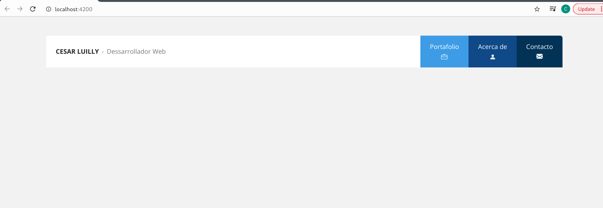
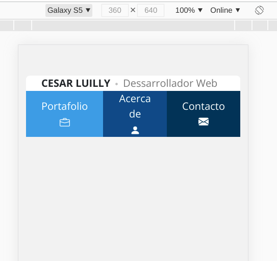

# Alternativas de boostrap
* https://ng-bootstrap.github.io/#/components/alert/examples

# UDYBootstrapPortafolio
* Liga del curso https://www.udemy.com/course/curso-bootstrap/

This project was generated with [Angular CLI](https://github.com/angular/angular-cli) version 11.2.1.

## Development server

Run `ng serve` for a dev server. Navigate to `http://localhost:4200/`. The app will automatically reload if you change any of the source files.

## Code scaffolding

Run `ng generate component component-name` to generate a new component. You can also use `ng generate directive|pipe|service|class|guard|interface|enum|module`.

## Build

Run `ng build` to build the project. The build artifacts will be stored in the `dist/` directory. Use the `--prod` flag for a production build.

## Running unit tests

Run `ng test` to execute the unit tests via [Karma](https://karma-runner.github.io).

## Running end-to-end tests

Run `ng e2e` to execute the end-to-end tests via [Protractor](http://www.protractortest.org/).

## Further help

To get more help on the Angular CLI use `ng help` or go check out the [Angular CLI Overview and Command Reference](https://angular.io/cli) page.

# Pasos del desarrollo del portafolio

## Paso para creal el Portafolio
> ### Video 65 - Encabezado
* Agrego las fuentes de Opens Sans de Ligh, regular, Bold (300, 400, 600, 700) al Index y en el css lo referencio.

* Encabezado Original a diseñar

* Creo la escructura del encabezado(Esqueleto) sin css
    * Ver commit https://github.com/cesarluilly/UDY-Bootstrap5-02Portafolio/commit/8c8c053f4ee55582b058af47dcbe3481df14d4fd

    * 

* Codigo terminado y presentacion del encabezado
    * **Desktop** 

    * **Mobile** 

> ### Video 66 - Slideshow
* Desarrollando el SlideShow y al estar utilizando las clases de bootstrap, automaticamente nuestro slideshow es
responsive 
    * **Desktop** 
    * **Mobile** 

> ### Video 67 - Galeria de trabajos (Parte I)
* Lo que se espera
    * 

> ### Video 68 - Galeria de trabajos (Parte II) - Diseño Responsive

> ### Video 69 - Galeria de trabajos (Parte III) - Codigo Javascript de la galeria

> ### Video 70 - Seccion de acerca de

> ### Video 71 - Formulario de contacto

> ### Video 72 - Pie de pagina